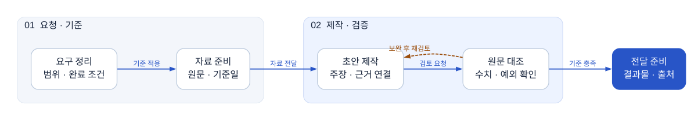
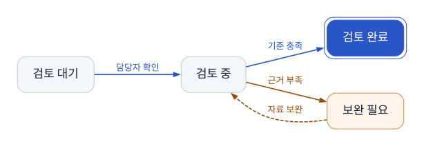
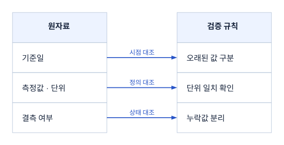
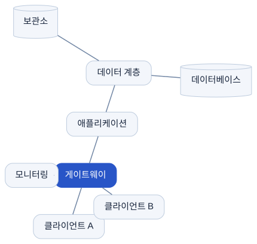

# Infographic Creator for Codex

[](https://github.com/Kimhyuntae9665/codex-skill-infographic-creator/actions/workflows/validate.yml)
[](LICENSE)

설명할 관계에 맞춰 AntV 또는 Graphviz를 선택하고, 편집 가능한 원본과 검수 가능한 시각 결과를 만드는 Codex Skill입니다.

This Codex skill routes an information-design request to AntV or Graphviz, selects a structure by semantics, and requires editable source plus final-size inspection.

## 무엇이 달라졌나

- **상황부터 선택:** 목록, 비교, 상태 전이, 책임 경계, 의존성, 데이터 모델, 계보, 인과, 자원 경합, 네트워크를 구분합니다.
- **Graphviz 갤러리 47개 전수 인덱스:** 2026-09-06 공식 Gallery 메인 목록의 모든 페이지와 제공 DOT 원본을 검토해 13개 실무 상황으로 분류했습니다.
- **의도 기반 후보 검색:** `승인 재시도`, `모듈 의존성`, `CPU 병목`, `버전 계보` 같은 설명에서 관련 예제를 점수화합니다.
- **원본 스타터 10개:** 갤러리 코드를 복제하지 않고, 수정 가능한 한국어 DOT 예제를 새로 작성했습니다.
- **검증 경계:** 렌더 성공, 구조 검사, 화면 검사, 최종 문서 검사를 별개의 사실로 다룹니다.

## 예시

| 책임 경계와 핸드오프 | 상태·재검토 루프 |
| --- | --- |
|  |  |
| 필드 단위 연결 | 네트워크 토폴로지 |
|  |  |

10개 전체 렌더와 적용 기준은 [examples/README.md](examples/README.md)에서 볼 수 있습니다. 예제의 내용은 구조를 설명하기 위한 가상 데이터입니다.

## 설치

### Windows PowerShell

```powershell
git clone https://github.com/Kimhyuntae9665/codex-skill-infographic-creator.git "$env:USERPROFILE\.codex\skills\infographic-creator"
```

### macOS / Linux

```bash
git clone https://github.com/Kimhyuntae9665/codex-skill-infographic-creator.git "$HOME/.codex/skills/infographic-creator"
```

이미 같은 폴더가 있으면 먼저 필요한 로컬 변경을 보존한 뒤 해당 저장소에서 `git pull`을 실행하세요.

## 사용 예시

Codex에서 스킬을 직접 지정하거나 일반 문장으로 요청할 수 있습니다.

```text
$infographic-creator를 사용해 승인 → 검토 → 보완 → 재검토 흐름을
한국어 SVG로 만들고, DOT 원본도 함께 남겨줘.
```

```text
이 시스템 설명은 팀 경계와 데이터 전달이 핵심이야.
Graphviz 후보를 먼저 고르고 최종 보고서 크기로 검수해줘.
```

구조가 분명하지 않을 때 선택기를 직접 실행할 수도 있습니다.

```bash
python scripts/select-graphviz-pattern.py "팀별 책임 경계와 승인 재시도" --limit 5
python scripts/select-graphviz-pattern.py "수백 개 모듈의 의존성과 커뮤니티" --json
```

선택기는 전체 예제를 작업마다 다시 읽지 않습니다. 검토된 인덱스에서 관련 후보만 제시하고, 실제 제작 단계에서 선택된 공식 페이지와 자체 스타터를 읽도록 구성했습니다.

## 47개 갤러리 범위

| 공식 Gallery 구역 | 항목 수 |
| --- | ---: |
| Directed | 23 |
| Neato | 8 |
| Undirected | 5 |
| Twopi | 3 |
| Gradient | 8 |
| **합계** | **47** |

- 읽기용 판단표: [references/graphviz-gallery-catalog.md](references/graphviz-gallery-catalog.md)
- 기계 판독 인덱스: [references/graphviz-gallery-index.json](references/graphviz-gallery-index.json)
- 독립 HTML 카탈로그: [docs/index.html](docs/index.html)

갤러리 원본 코드와 이미지는 항목별 라이선스가 다르므로 이 저장소에 묶지 않았습니다. 공식 URL, 메타데이터, 자체 분석과 새로 작성한 스타터만 제공합니다.

## 직접 렌더링

Graphviz CLI가 있다면 각 스타터에 맞는 엔진을 사용합니다.

```bash
dot -Kdot -Tsvg assets/graphviz/state-review.dot -o state-review.svg
dot -Ktwopi -Tsvg assets/graphviz/network-topology.dot -o network-topology.svg
```

Graphviz CLI가 없으면 로컬 `@viz-js/viz`와 제공된 Node 도구를 사용할 수 있습니다.

```bash
npm install --save-dev @viz-js/viz@3.30.0
node scripts/render-graphviz.mjs assets/graphviz/state-review.dot state-review.svg --engine dot
```

자세한 한글 글꼴, 포트, 클러스터, 경고 처리와 `sfdp` 호환성 조건은 [references/graphviz-rendering.md](references/graphviz-rendering.md)를 따릅니다.

## 검증

```bash
python scripts/validate-gallery-catalog.py
python scripts/validate-starters.py
```

첫 번째 검사는 47개 고유 항목, 검토 상태, 내부 링크와 스타터 목록을 확인합니다. 두 번째 검사는 설치된 Graphviz로 10개 스타터를 실제 렌더링해 노드·연결선·클러스터 수와 SVG geometry를 확인합니다. 두 검사 모두 최종 크기의 육안 검수를 대신하지 않습니다.

## 저장소 구조

```text
SKILL.md                         Codex 진입점과 완료 조건
assets/graphviz/                원본 DOT 스타터 10개
references/                     AntV·Graphviz 설계, 렌더링, 갤러리 판단표
scripts/select-graphviz-pattern.py  상황별 후보 선택기
scripts/render-graphviz.mjs     Viz.js 기반 DOT → SVG 렌더러
scripts/validate-*.py           카탈로그와 스타터 검증
examples/rendered/              검수한 SVG 예시 10개
docs/index.html                 검색·필터 가능한 독립 카탈로그
```

## 알려진 제한

- 이번 전수 범위는 공식 Graphviz Gallery 메인 인덱스가 연결한 47개입니다. 외부 갤러리 전체를 복제한 모음은 아닙니다.
- `sfdp` 대규모 그래프는 런타임과 입력에 따라 동작 차이가 확인됐습니다. 대표 부분집합을 먼저 렌더링하고 오류나 중단이 없는 런타임만 사용해야 합니다.
- 갤러리 페이지와 DOT 원본 47개를 검토했지만, 모든 원본 결과 이미지를 여러 운영체제에서 재렌더링했다는 의미는 아닙니다.

## 출처와 라이선스

초기 AntV 문법 자료는 [AntV Infographic](https://github.com/antvis/Infographic)의 MIT 라이선스 소스를 고정 커밋에서 가져왔습니다. 세부 이력은 [references/upstream.md](references/upstream.md)에 기록했습니다. Graphviz 구조 연구는 [공식 Gallery](https://graphviz.org/gallery/)와 [공식 문서](https://graphviz.org/documentation/)를 참조했습니다.

이 저장소에서 새로 작성한 지침, 스크립트, DOT 스타터와 예제는 [MIT License](LICENSE)로 배포합니다. 제3자 상표와 링크된 외부 콘텐츠에는 각 원저작자의 조건이 적용됩니다.
